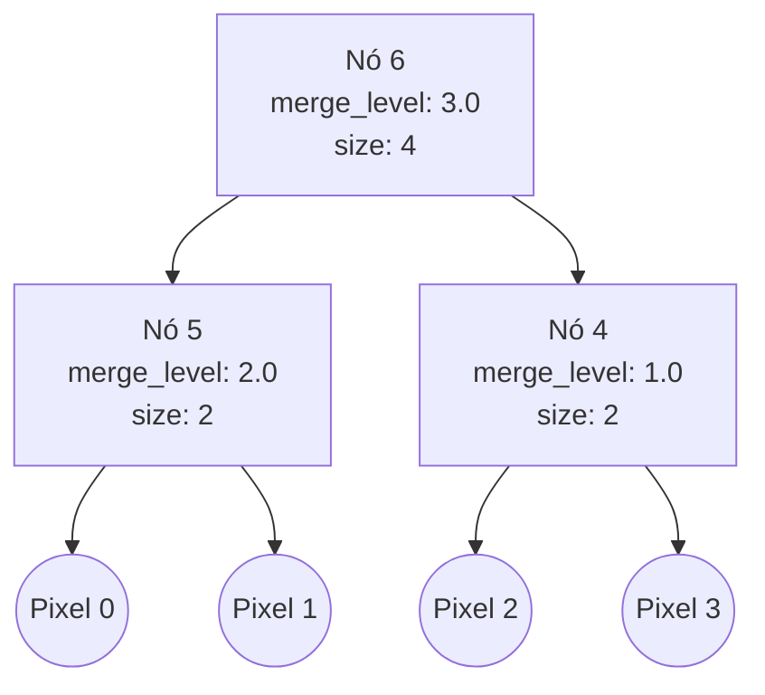

# Estudo de Segmentações Hierárquicas Baseadas em Grafos

Este documento apresenta a análise técnica do artigo "Hierarchical segmentations with graphs: quasi-flat zones, minimum spanning trees, and saliency maps" (Jean Cousty, Laurent Najman, Yukiko Kenmochi, Silvio Guimarães, 2018). O objetivo é detalhar as definições teóricas, as relações fundamentais do modelo e os algoritmos que guiarão a implementação da segmentação hierárquica por quasi-flat zones.

---

## 1. Fundamentos Teóricos

### 1.1. Hierarquias de Partições
Seja $V$ o conjunto finito de vértices do grafo, correspondente aos pixels da imagem. Uma partição $\mathbf{P}$ de $V$ é um conjunto de subconjuntos não vazios e disjuntos de $V$ cuja união é igual a $V$. Cada subconjunto $X \in \mathbf{P}$ é denominado uma região.

Dadas duas partições $\mathbf{P}$ e $\mathbf{P}'$ de $V$, diz-se que $\mathbf{P}'$ é um refinamento de $\mathbf{P}$ se toda região de $\mathbf{P}'$ estiver contida em alguma região de $\mathbf{P}$.

Uma hierarquia de partições $\mathcal{H} = (\mathbf{P}_0, \dots, \mathbf{P}_\ell)$ é uma sequência de partições de $V$ onde:
1. $\mathbf{P}_{i-1}$ é um refinamento de $\mathbf{P}_i$ para todo $i \in \{1, \dots, \ell\}$.
2. $\mathbf{P}_0 = \{\{x\} \mid x \in V\}$ representa a partição inicial onde cada elemento é um conjunto unitário (folhas).
3. $\mathbf{P}_\ell = \{V\}$ representa a partição final composta por uma única região contendo todos os elementos (raiz).

### 1.2. Quasi-Flat Zones (QFZ)
Considere um grafo não direcionado conexo $(G, w)$, onde $V$ é o conjunto de vértices, $E$ é o conjunto de arestas e $w: E \to \mathbb{R}^+$ é uma função que atribui pesos às arestas (dissimilaridade).

Para um determinado limite $\lambda \ge 0$, o subgrafo de nível $\lambda$, denotado por $w_\lambda^V(G)$, é o grafo $(V, E_\lambda)$ tal que:
$$E_\lambda = \{u \in E \mid w(u) < \lambda\}$$

A partição de componentes conexos de $w_\lambda^V(G)$ é chamada de partição de nível $\lambda$. A família de todas as partições de nível $\lambda$ obtidas ao variar $\lambda$ define a hierarquia de quasi-flat zones de $G$ para a função de pesos $w$, denotada por $QFZ(G, w)$.

### 1.3. Mapa de Saliência
O mapa de saliência é uma representação alternativa de uma hierarquia $\mathcal{H}$. Trata-se de uma função $S: E \to \mathbb{R}^+$ na qual o peso de cada aresta $u = \{x, y\}$ é definido como o maior valor de $\lambda$ para o qual os vértices $x$ e $y$ pertencem a regiões distintas na partição correspondente. 

Matematicamente:
$$S(u) = \max \{ \lambda \mid u \in \phi_G(\mathbf{P}_\lambda) \}$$
Onde $\phi_G(\mathbf{P}_\lambda)$ representa o conjunto de arestas cujos extremos estão em regiões separadas de $\mathbf{P}_\lambda$ (o corte de $\mathbf{P}_\lambda$).

---

## 2. Equivalência Teórica e o Papel da MST

Um dos principais resultados do artigo estabelece a relação de equivalência entre a hierarquia do grafo completo e a de suas árvores geradoras mínimas:

> **Teorema de Equivalência da MST:**
> Se $X$ é uma árvore geradora mínima (MST) de um grafo ponderado $(G, w)$, então a hierarquia de quasi-flat zones de $X$ é idêntica à de $G$:
> $$QFZ(X, w) = QFZ(G, w)$$

Esta propriedade garante que todas as fusões de componentes que ocorrem no grafo original podem ser descritas e calculadas utilizando apenas as arestas presentes na MST. Como uma MST em um grafo de $n$ vértices possui exatamente $n-1$ arestas, o processamento da hierarquia torna-se significativamente mais eficiente do que no grafo completo, reduzindo a complexidade de tempo e o consumo de memória.

---

## 3. Estruturas de Dados e Algoritmos

A hierarquia é representada computacionalmente através de uma árvore de partição binária (Binary Partition Tree por ordem de altitude, ou BPTAO).

Cada nó interno da árvore representa a fusão de dois componentes conexos, contendo as seguintes propriedades:
* `id`: Identificador numérico do nó.
* `left_child`: Identificador do filho esquerdo.
* `right_child`: Identificador do filho direito.
* `merge_level`: O valor de $\lambda$ (peso da aresta da MST) que causou a fusão.
* `size`: O número total de pixels contidos na região representada pelo nó.

### 3.1. Construção da Hierarquia a partir da MST

O algoritmo recebe as arestas da MST ordenadas por peso crescente e utiliza uma estrutura de conjuntos disjuntos (Union-Find) para rastrear os representantes dos componentes conexos e seus respectivos nós na hierarquia.

```text
Função construir_hierarquia(mst_arestas, num_vertices):
    n = num_vertices
    Inicializar vetor nos com tamanho 2n - 1
    
    // Inicialização das folhas (pixels)
    Para i de 0 até n - 1:
        nos[i].id = i
        nos[i].left_child = -1
        nos[i].right_child = -1
        nos[i].merge_level = 0.0
        nos[i].size = 1
        
    dsu = novo DisjointSet(n)
    no_da_componente = vetor de tamanho n (no_da_componente[i] = i)
    next_id = n
    
    // Processamento das fusões pelas arestas da MST
    Para cada aresta (u, v, peso) em mst_arestas:
        raiz_u = dsu.find(u)
        raiz_v = dsu.find(v)
        
        Se raiz_u != raiz_v:
            id_novo_no = next_id
            next_id = next_id + 1
            
            nos[id_novo_no].id = id_novo_no
            nos[id_novo_no].left_child = no_da_componente[raiz_u]
            nos[id_novo_no].right_child = no_da_componente[raiz_v]
            nos[id_novo_no].merge_level = peso
            nos[id_novo_no].size = dsu.component_size(raiz_u) + dsu.component_size(raiz_v)
            
            dsu.unite(raiz_u, raiz_v)
            nova_raiz = dsu.find(raiz_u)
            no_da_componente[nova_raiz] = id_novo_no
            
    retornar nos, (next_id - 1)
```

### 3.2. Corte na Hierarquia (`cut_at_level`)

Este procedimento realiza o corte horizontal na árvore em um nível $\lambda$, retornando um vetor de labels para os pixels.

```text
Função cortar_hierarquia(nos, raiz, lambda, num_vertices):
    labels = vetor de inteiros com tamanho num_vertices (inicializado com -1)
    label_atual = 0
    
    pilha = nova Pilha()
    pilha.push(raiz)
    
    Enquanto pilha não vazia:
        atual = pilha.pop()
        
        Se nos[atual].left_child == -1 e nos[atual].right_child == -1:
            labels[atual] = label_atual
            label_atual = label_atual + 1
        Senão se nos[atual].merge_level > lambda:
            pilha.push(nos[atual].left_child)
            pilha.push(nos[atual].right_child)
        Senão:
            atribuir_label_descendentes(atual, label_atual, labels, nos)
            label_atual = label_atual + 1
            
    retornar labels

Função atribuir_label_descendentes(no_id, label, labels, nos):
    pilha_aux = nova Pilha()
    pilha_aux.push(no_id)
    
    Enquanto pilha_aux não vazia:
        atual = pilha_aux.pop()
        Se nos[atual].left_child == -1 e nos[atual].right_child == -1:
            labels[atual] = label
        Senão:
            pilha_aux.push(nos[atual].left_child)
            pilha_aux.push(nos[atual].right_child)
```

### 3.3. Geração do Mapa de Saliência via LCA

Para calcular a saliência de cada aresta do grafo original, o algoritmo localiza o Mínimo Ancestral Comum (LCA) dos extremos da aresta na árvore da hierarquia. A altitude de fusão desse LCA indica a relevância da fronteira.

```text
Função gerar_mapa_saliencia(grafo, nos, raiz):
    saliencia_arestas = cópia de grafo.edges
    lca_preprocessamento = preparar_lca(nos, raiz) // O(n log n) ou O(n)
    
    Para cada aresta u = (x, y) em grafo.edges:
        no_lca = buscar_lca(lca_preprocessamento, x, y)
        saliencia_arestas[u].weight = nos[no_lca].merge_level
        
    retornar saliencia_arestas
```

---

## 4. Exemplo de Execução

### 4.1. Grafo de Entrada
Considere um grafo de imagem bidimensional contendo 4 pixels dispostos em uma grade $2 \times 2$:

```mermaid
graph TD
    0((0)) -- 2.0 -- 1((1))
    |                |
    5.0              3.0
    |                |
    2((2)) -- 1.0 -- 3((3))
```

Arestas originais ordenadas por peso crescente:
1. $\{2, 3\}$ com peso $1.0$
2. $\{0, 1\}$ com peso $2.0$
3. $\{1, 3\}$ com peso $3.0$
4. $\{0, 2\}$ com peso $5.0$

### 4.2. Passo 1: Execução do Algoritmo de Kruskal (MST)
As arestas são analisadas sequencialmente:
* Aresta $\{2, 3\}$ (peso 1.0): Une os vértices $2$ e $3$. Adicionada à MST.
* Aresta $\{0, 1\}$ (peso 2.0): Une os vértices $0$ e $1$. Adicionada à MST.
* Aresta $\{1, 3\}$ (peso 3.0): Une os componentes $\{0, 1\}$ e $\{2, 3\}$. Adicionada à MST.
* Aresta $\{0, 2\}$ (peso 5.0): Ignorada, pois seus extremos já estão conectados (ciclo).

Arestas selecionadas para a MST: $\{2, 3\}$ ($1.0$), $\{0, 1\}$ ($2.0$), $\{1, 3\}$ ($3.0$).

### 4.3. Passo 2: Construção do Dendrograma
Vértices folhas iniciais (pixels):
* Nós $0, 1, 2, 3$ com `merge_level = 0.0` e `size = 1`.

Processamento das arestas da MST:
1. **Aresta $\{2, 3\}$ (peso 1.0):**
   Une os componentes representados pelos nós $2$ e $3$.
   Cria-se o nó interno **$4$** com `left_child = 2`, `right_child = 3`, `merge_level = 1.0`, `size = 2`.
2. **Aresta $\{0, 1\}$ (peso 2.0):**
   Une os componentes representados pelos nós $0$ e $1$.
   Cria-se o nó interno **$5$** com `left_child = 0`, `right_child = 1`, `merge_level = 2.0`, `size = 2`.
3. **Aresta $\{1, 3\}$ (peso 3.0):**
   A componente de $1$ é representada por $5$ e a de $3$ é representada por $4$.
   Cria-se o nó interno **$6$** (raiz) com `left_child = 5`, `right_child = 4`, `merge_level = 3.0`, `size = 4`.



### 4.4. Passo 3: Corte da Hierarquia para $\lambda = 2.5$
O corte horizontal avalia a árvore de cima para baixo:
1. Inicia na raiz (Nó 6). Como `merge_level` ($3.0$) $>$ $2.5$, o nó é dividido. Descemos para os nós $5$ e $4$.
2. Nó 5: Como `merge_level` ($2.0$) $\le$ $2.5$, a busca é interrompida neste ramo. Todos os descendentes do nó 5 (pixels 0 e 1) recebem o mesmo rótulo.
   * Rótulo 0: Pixels $\{0, 1\}$.
3. Nó 4: Como `merge_level` ($1.0$) $\le$ $2.5$, a busca é interrompida neste ramo. Todos os descendentes do nó 4 (pixels 2 e 3) recebem o mesmo rótulo.
   * Rótulo 1: Pixels $\{2, 3\}$.

A segmentação resultante produz duas partições planas: a primeira contendo os pixels $\{0, 1\}$ e a segunda contendo os pixels $\{2, 3\}$.
